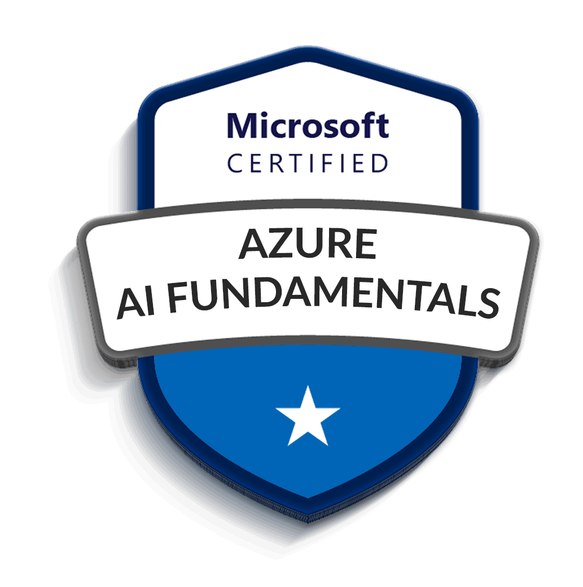
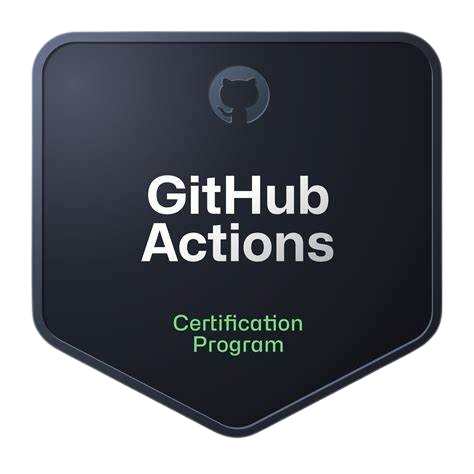
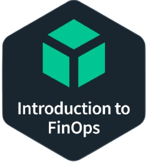

### Welcome my Personal GitHub 👋

````json
{
  "name": "Felipe Augusto",
  "title": "Microsoft MVP",
  "professionalRoles": [
    {
      "role": "Technical Architecture Manager",
      "company": "Avanade"
    },
    {
      "course": "MIT Systems Architecture",
      "institution": "Infnet"
    }
  ],
  "hobbies": [
    "Sailing",
    "Playing sports",
    "Running",
    "Bodyboarding",
    "Skateboarding",
    "Cycling",
    "Helping people develop",
    "Studying"
  ]
}
````
[](https://github.com/felipementel/badges/)
[](https://code.visualstudio.com/)


[](https://github.com/felipementel/github-readme-stats)

[](https://www.linkedin.com/in/felipementel/)
[](https://stackoverflow.com/users/8104755/felipe-augusto?tab=profile)

## Reconhecimentos 🔐

  <a href="https://mvp.microsoft.com/en-US/mvp/profile/f6d8ec73-8d9d-4795-b1e6-ab78dc823362" target="_blank"></a>
  

## Certificações 🏆

### Microsoft Azure

<div>
  
  
  
  
  
  
  
  
  
  
  
  
</div>

### AWS

<div>
  
</div>

### Accenture

<div>
  
  
</div>

### GitHub

<div>
  
  
  
  
  

  
  
</div>

### Exin

<div>
  
</div>

### Linux Foundation

<div>
  
  
  
  
  
  
  
</div>

## Stack 🛠️

<div style="display: inline_block"><br>
    
    
    
    
    
    
    
    
    
    
    
    
    
    
    
    
    
    
    
    
    
    
    
    
    
</div>

## Views


[](https://user-badge.committers.top/brazil/felipementel)

<!--
**felipementel/felipementel** is a ✨ _special_ ✨ repository because its `README.md` (this file) appears on your GitHub profile.

Here are some ideas to get you started:

- 🔭 I’m currently working on ...
- 🌱 I’m currently learning ...
- 👯 I’m looking to collaborate on ...
- 🤔 I’m looking for help with ...
- 💬 Ask me about ...
- 📫 How to reach me: ...
- 😄 Pronouns: ...
- ⚡ Fun fact: ...
-->
